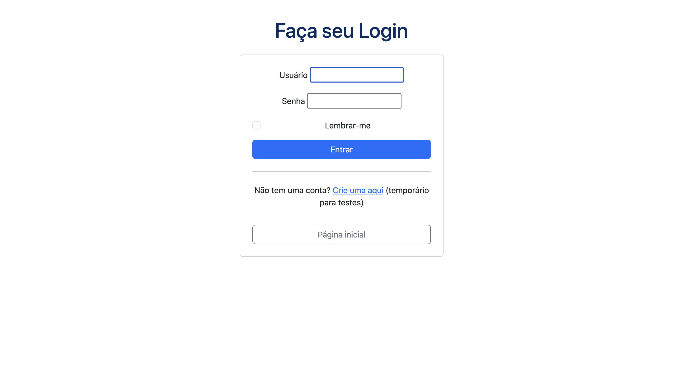
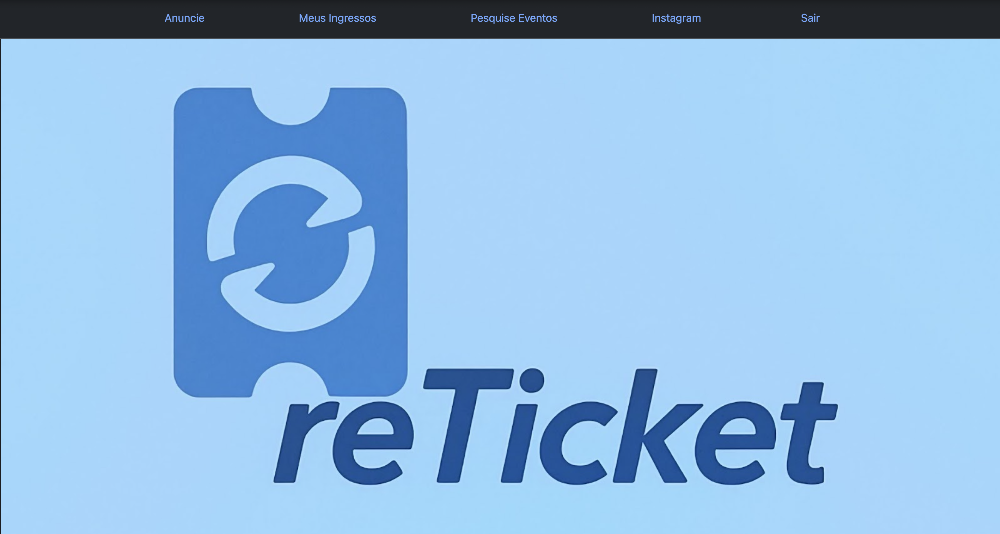
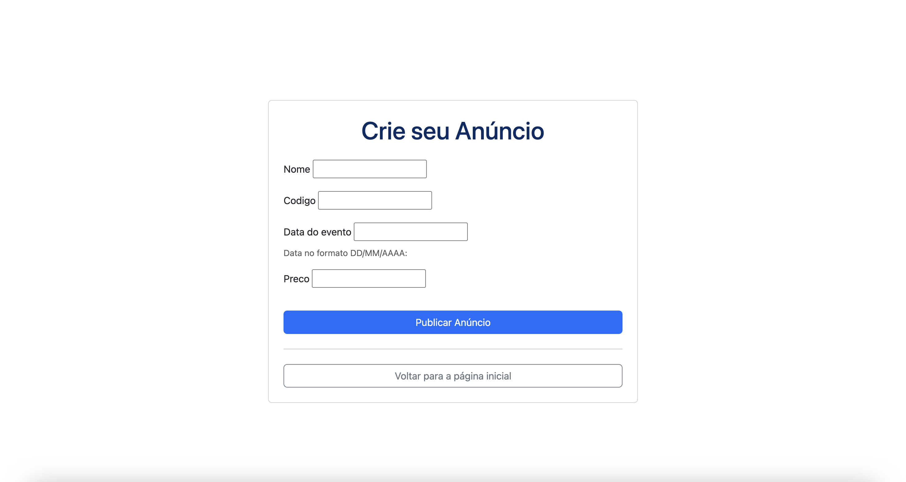
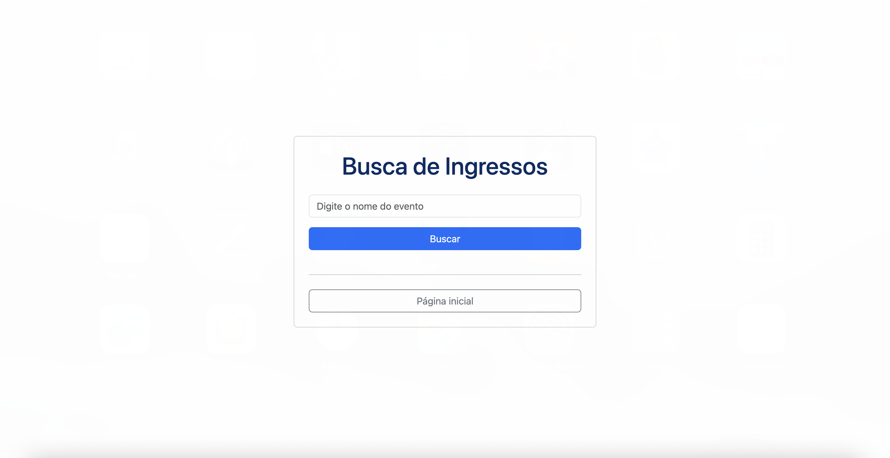
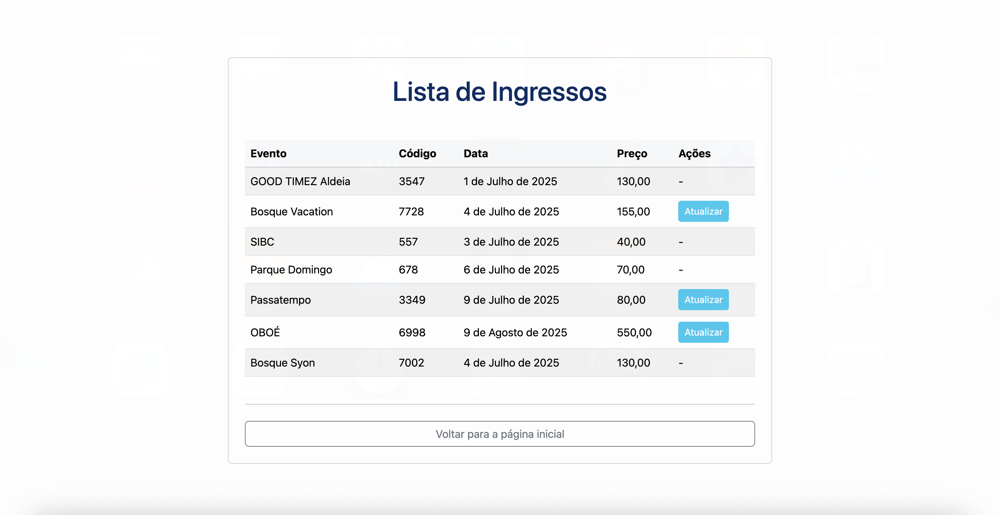

# ReTicket

Plataforma colaborativa e segura para revenda de ingressos.

## 👥 Integrantes

* João Castro
* Pedro Tatagiba
* Diogo Augusto
* João Rosauro

---

## 📄 Descrição do Projeto

A **reTicket** é uma plataforma online desenvolvida para simplificar e securizar a revenda de ingressos para eventos. Nosso objetivo é criar uma comunidade onde usuários possam disponibilizar seus ingressos de forma fácil e que outros interessados possam encontrá-los e adquiri-los de maneira confiável.

### Principais Funcionalidades:

* **Página de Login/Cadastro**: Ao acessar a plataforma, os usuários serão direcionados para uma página de login ou para criar uma nova conta (Conta teste -> usuário: teste ; senha: reTicket123).
    

* **Página Inicial**: Ao acessar a plataforma com os dados de login, os usuário são direcionados para a página inicial.
    

* **Publicar Anúncio**: Usuários podem listar seus ingressos para venda em uma seção dedicada, informando detalhes como nome do evento, código do ingresso, data e preço.
    

* **Meus Ingressos**: Uma área onde o vendedor pode visualizar e gerenciar os ingressos que colocou à venda.
    

* **Pesquisar Eventos**: Compradores podem buscar ingressos disponíveis digitando o nome do evento.
    

* **Listar Eventos**: Ao buscar uma plavra-chave mostra os ingressos existentes disponíveis (buscar: ' ' ; para mostrar todos disponíveis).
    

* **Detalhes da Oferta**: Ao clicar em um ingresso listado, o comprador será direcionado para uma página com mais detalhes da oferta para concluir a transação.
* **Cancelamento de Compra**: Em caso de desistência, o cliente tem a opção de cancelar a compra e continuar navegando na plataforma.

---

## 🚀 Como Executar o Projeto Localmente

Siga os passos abaixo para configurar e rodar o projeto `reTicket` em sua máquina local.

### Pré-requisitos

Certifique-se de ter o Python e o pip instalados em seu sistema.

### Passos para Configuração

1.  **Crie o diretório do projeto e navegue até ele**:

    ```sh
    mkdir reTicket
    cd reTicket
    ```

2.  **Crie e ative um ambiente virtual**:
    É altamente recomendado usar um ambiente virtual para isolar as dependências do projeto.

    ```sh
    python -m venv venv
    # No Windows:
    # .\venv\Scripts\activate
    # No macOS/Linux:
    source venv/bin/activate
    ```

3.  **Instale as dependências do projeto**:
    Certifique-se de ter um arquivo `requirements.txt` com todas as dependências listadas.

    ```sh
    pip install -r requirements.txt
    ```

    *Se você ainda não criou o `requirements.txt`, pode gerá-lo após instalar as bibliotecas do projeto com:* `pip freeze > requirements.txt`

4.  **Crie o projeto Django (se ainda não tiver feito)**:
    Se o projeto Django ainda não foi inicializado, crie-o. *Se você já tem a estrutura do projeto, pule este passo.*

    ```sh
    django-admin startproject Ingressos .
    ```
    *Obs: O ponto final `.` indica que o projeto será criado no diretório atual, evitando um diretório aninhado.*

5.  **Aplique as Migrações (se aplicável)**:
    Se houver modelos de banco de dados definidos, aplique as migrações para criar as tabelas no banco de dados.

    ```sh
    python manage.py makemigrations
    python manage.py migrate
    ```

6.  **Execute o servidor de desenvolvimento**:
    Navegue até o diretório que contém `manage.py` (normalmente o diretório raiz do seu projeto Django, que você nomeou como `Ingressos` ou `reTicket` dependendo de como você organizou).

    ```sh
    # Se você está no diretório 'reTicket' e o 'manage.py' está nele:
    python manage.py runserver
    # Se 'manage.py' estiver em um subdiretório chamado 'Ingressos':
    # cd Ingressos
    # python manage.py runserver
    ```

    Após executar o comando, o servidor estará disponível em `http://127.0.0.1:8000/` (ou outro endereço, conforme exibido no seu terminal).

---

## 📧 Contato

Para dúvidas ou sugestões, entre em contato com os desenvolvedores:

* João Castro
* Pedro Tatagiba
* Diogo Augusto
* João Rosauro

---